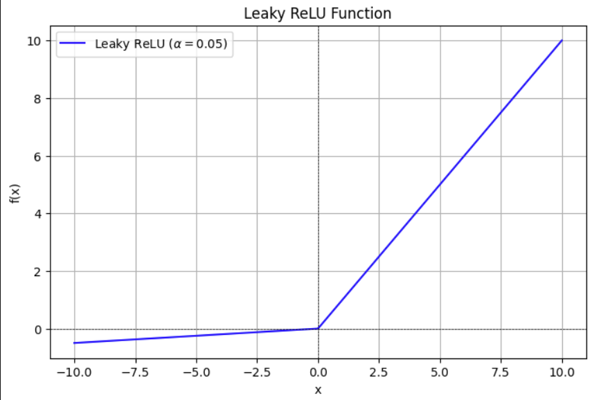
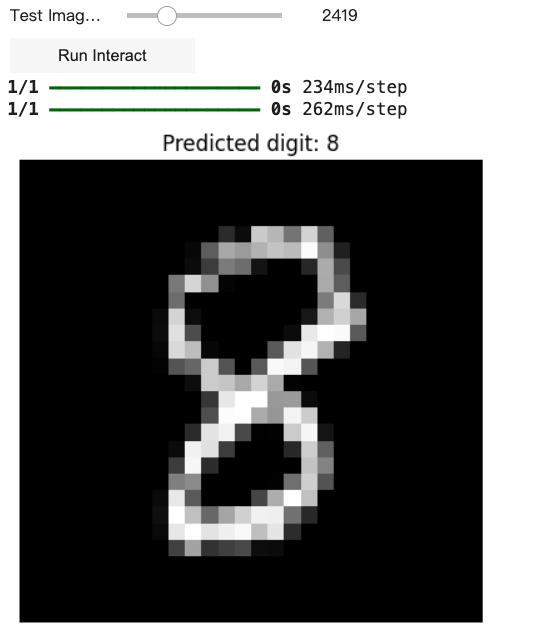
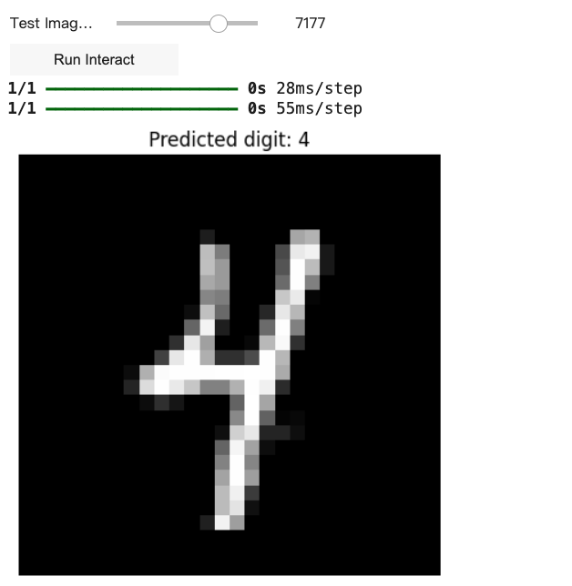

# generative_ai

- 姓名：林冠宇
- 系級：資工 115
- 課程名稱：生成式 AI：文字與圖像生成的原理與實務\_國立臺灣師範大學衛星課程
- 修課學期：113-2

## 檔案說明

- `HW1.ipynb`: 畫一個函數圖形 (leaky relu) 並說明

  ### 圖形展示

  

- `HW2.ipynb`: 設計並訓練一個全連接 (Fully-Connected) 的深度神經網路 (DNN)，用以進行 MNIST 手寫數字辨識。

  ### 測試效果展示

  實際在測試集上預測效果圖：  
   

  在 gradio 上手繪數字進行測試：  
  

- `HW3.ipynb`: 主題二、研究GAN背後原理，試著用自己的方式解釋Cross Entropy、KL divergence。

- `HW4.ipynb`: 建立自己的 benchmarks 測試不同的 LLM，這邊提出了兩個問題，分別是算字數問題以及經典的電車難題，主要想測試 LLM 的邏輯推理能力。

